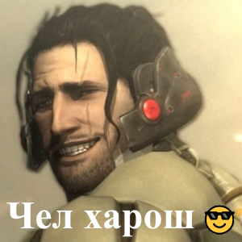

## *CV For RSS*

---

**First and second name**  
 Kajarov Azat  
 

---

**Contacts**
- *Discord: Limuw#8712;*
- [*GitHub*](https://github.com/Limuw);
- [*VK*](https://vk.com/li__meow); 
- [*Twitter*](https://twitter.com/itsLimuw);
- [*Twitch*](https://www.twitch.tv/itslimuw);
- [*Shikimori*](https://shikimori.one/Limuw);  

---

**Info**  
>I want to learn new skills in programming,  
especially frontend  development, i think  
RS School courses will assist me in  
achieving this goal.  

---

**Skills**  
Beginner level of C#

---

**Code example**  

```js
const canv = document.getElementsByTagName("canvas")[0];
const ctx = canv.getContext("2d");

const render = (road) => {
  ctx.clearRect(0, 0, canv.width, canv.height);
  ctx.strokeStyle = road.color;
  ctx.beginPath();
  if (road.dots.length) {
    ctx.moveTo(road.dots[0].x, road.dots[0].y);
    ctx.arc(road.dots[0].x, road.dots[0].y, 1, 0, 360);

    ctx.moveTo(road.dots[0].x, road.dots[0].y);
    for (let i = 1; i < road.dots.length; i++) {
      ctx.lineTo(road.dots[i].x, road.dots[i].y);
    }
    ctx.stroke();
  }
};

const renderRoads = (roads, objects) => {
  ctx.clearRect(0, 0, canv.width, canv.height);
  if (roads.length) {
    roads.forEach((road) => {
      ctx.strokeStyle = road.color;
      ctx.beginPath();
      if (road.dots.length) {
        ctx.moveTo(road.dots[0].x, road.dots[0].y);
        ctx.arc(road.dots[0].x, road.dots[0].y, 1, 0, 360);

        ctx.moveTo(road.dots[0].x, road.dots[0].y);
        for (let i = 1; i < road.dots.length; i++) {
          ctx.lineTo(road.dots[i].x, road.dots[i].y);
        }
      }
      ctx.stroke();
    });
  }
  if (objects.length) {
    objects.forEach((obj) => {
      ctx.strokeStyle = obj.color;
      ctx.fillStyle = obj.color;
      ctx.beginPath();
      if (obj.type === "square") {
        ctx.rect(
          obj.x - obj.size / 2,
          obj.y - obj.size / 2,
          obj.size,
          obj.size
        );
      }
      if (obj.type === 'circle') {
        ctx.arc(obj.x - obj.size, obj.y - obj.size, obj.size, 0, 360);
      }
      ctx.fill();
      ctx.stroke();
    });
  }
};
```   

---

**Working Experience**  
     None yet

---

**Education**  
BSUIR filial "MRC";

---

**English level**  
According to EPAM English test - C1.


